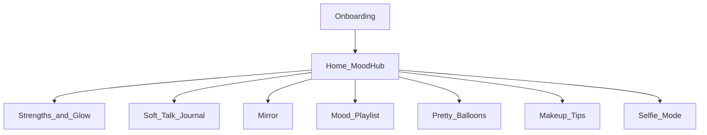
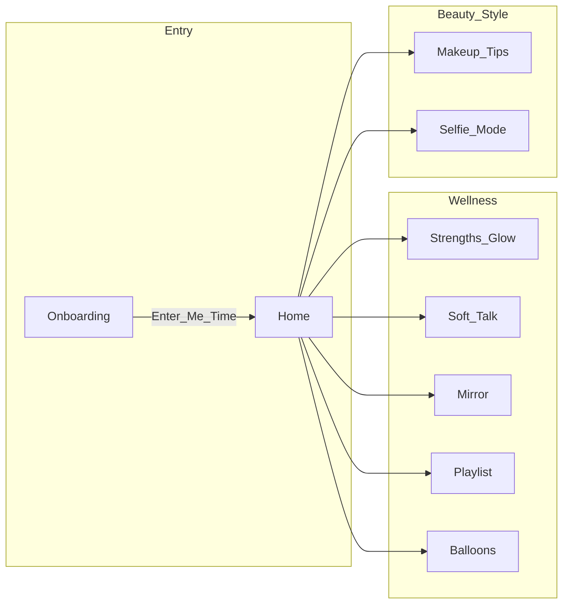
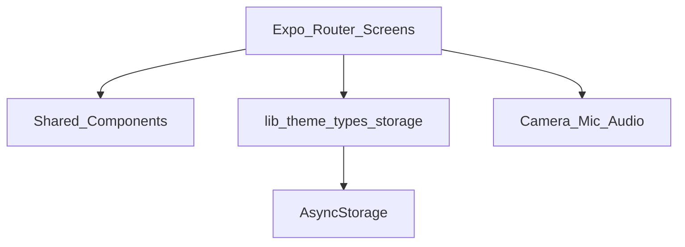

# MeTime — Project Overview & Scope

**Product:** MeTime (private self-care companion)  
**Platform:** Expo (React Native) + Expo Router — Android, iOS (Expo Go), Web  
**Version focus:** Local-first MVP (no accounts, no backend)  
**Origin:** Handwritten product notes in `roughplan.jpeg`

---

## 1. One-line overview

MeTime is a **private, soft-styled wellness app** where you check mood, reflect on strengths, journal by text or mic, release emotions in Mirror, save mood music, play an affirmation balloon game, browse makeup tips, and capture outfit selfies — all stored on-device.

---

## 2. Product principles

| Principle | Meaning in the app |
|-----------|-------------------|
| Strengths first | Celebrate what the user is good at |
| No shame labels | Growth tips are shown as **“Do this”** — never titled “weakness” |
| No disturbance | Calm UI, no social feed, no pushy notifications |
| Private by default | AsyncStorage on device; no cloud sync in current scope |
| Soft / feminine aesthetic | Blush–rose palette, Cormorant + Quicksand, pastel feature cards |

---

## 3. Project scope

### In scope (built now)



| Area | Included |
|------|----------|
| Auth / accounts | No — optional name only |
| Backend / API | No |
| Data storage | Local AsyncStorage |
| Camera | Mirror + Selfie Mode |
| Microphone | Soft Talk voice notes |
| Gamification | Balloon pop + glitter + funny sound + good words |
| Beauty | Static makeup tip cards |
| Fashion | Outfit selfie capture + soft look feedback |
| Music | Favorite track list + mood tags + open external links |

### Out of scope (current build)

- Login, cloud sync, encrypted backup  
- Social / share feed  
- Real AI stylist / vision model for outfits  
- Spotify / YouTube official API integration  
- Push notifications / shopping checkout  
- Weather-based “what to wear”  
- Hindi full localization (copy is English; room to add later)

### Possible future phases

| Phase | Ideas |
|-------|--------|
| Later polish | Richer playlists, DND session timer, bilingual UI |
| Fashion+ | What to wear today, wardrobe tags (handbags, footwear), AI look coach |
| Cloud optional | Account + encrypted sync |

---

## 4. UI map (screens & figure)

### 4.1 Navigation figure



### 4.2 Screen inventory

| Route | Screen title | UI purpose | Key UI elements |
|-------|--------------|------------|-----------------|
| `/onboarding` | — | First-time private intro | Rose gradient banner, optional name, CTA |
| `/` | Home | Mood hub + navigation | Hero gradient card, mood tile board, bento NavCards |
| `/strengths` | Strengths & Glow | Strengths + growth tips | Add forms, strength chips, “Do this” tip cards |
| `/speak` | Soft Talk | Text + voice journal | Prompt chips, mood tiles, **mic button**, note list |
| `/mirror` | Mirror | Emotional release camera | Full-screen front camera, calm overlay |
| `/music` | Mood Playlist | Favorite tracks by mood | Mood filter, add track, open link |
| `/game` | Pretty Balloons | Affirmation mini-game | Floating balloons, glitter, pop sound, good-word banner |
| `/makeup` | Makeup Tips | Beauty tips library | Category filters, gradient tip cards |
| `/selfie` | Selfie Mode | Outfit selfies | Attire tags, front camera, look note, saved gallery |

### 4.3 Home UI layout (first viewport figure)

```
┌─────────────────────────────────────┐
│  [ Soft pink gradient + orbs ]      │
│  ┌───────────────────────────────┐  │
│  │ ME TIME                       │  │
│  │ Hey, {name}                   │  │  ← Hero
│  │ Your soft little sanctuary…   │  │
│  └───────────────────────────────┘  │
│  Pick today’s vibe                  │
│  ┌──────┐ ┌──────┐                  │
│  │Happy │ │ Sad  │                  │  ← Mood tiles
│  └──────┘ └──────┘                  │
│  ┌──────┐ ┌──────┐                  │
│  │Calm  │ │Uneasy│                  │
│  └──────┘ └──────┘                  │
│  ┌─────────────────┐                │
│  │ Glow (wide)     │                │
│  └─────────────────┘                │
│  Your spaces                        │
│  [ Strengths & Glow — large card ]  │
│  [ Soft Talk ] [ Mirror ]           │  ← Bento grid
│  [ Playlist  ] [ Balloons ]         │
│  [ Makeup Tips ]                    │
│  [ Selfie Mode ]                    │
└─────────────────────────────────────┘
```

### 4.4 Visual system (UI figure)

| Token | Role |
|-------|------|
| Blush / mist pinks | Background atmosphere |
| Rose `#B84E74` | Primary accents, CTAs, hero |
| Pastel card tones | Rose, lilac, mint, butter, peach feature cards |
| Cormorant Garamond | Display / titles |
| Quicksand | Body / labels |
| Soft shadows + gradients | Depth without harsh “dashboard” chrome |

Shared UI building blocks live in `components/`:

- `Screen` — gradient shell + decorative orbs  
- `AppText`, `Button`  
- `MoodPicker`, `NavCard`, `TextField` (`components/ui.tsx`)  
- `GlitterBurst` — balloon pop particles  
- `Decor` / `SparkField` — ambient sparkles  

---

## 5. Feature detail (what each screen does)

### Wellness

1. **Onboarding** — Privacy framing + optional name.  
2. **Home** — Set mood; open all spaces.  
3. **Strengths & Glow** — Add strengths (proud list) and private growth actions (“Do this”).  
4. **Soft Talk** — Prompts; write notes; **mic** to record voice notes; play/delete entries.  
5. **Mirror** — Front camera only for shout/cry release (no recording).  
6. **Playlist** — Save titled favorites with mood tags; tap opens YouTube/Spotify-style links.  
7. **Pretty Balloons** — Pop balloons → glitter + funny sound → good words only (e.g. *You are beautiful*, *Be yourself*). Strengths are **not** shown here.

### Beauty & style

8. **Makeup Tips** — Filterable static tips (Skin / Base / Eyes / Lips / Glow).  
9. **Selfie Mode** — Tag attire, capture front selfie, soft look feedback, save gallery locally.

---

## 6. Technical architecture



| Layer | Path | Role |
|-------|------|------|
| Screens | `app/*.tsx` | Routes & feature UI |
| Components | `components/` | Reusable UI |
| Domain | `lib/types.ts` | Models (Profile, Strength, Journal, Track, OutfitSelfie, …) |
| Persistence | `lib/storage.ts` | AsyncStorage CRUD |
| Theme | `lib/theme.ts` | Colors, fonts, card tones, shadows |
| Assets | `assets/` | Icons, fonts, `sounds/funny-pop.wav` |

**Stack:** Expo SDK 57 · React Native · TypeScript · Expo Router · expo-camera · expo-av · AsyncStorage · LinearGradient · Google Fonts  

---

## 7. Data model (local)

| Entity | Fields (summary) |
|--------|------------------|
| `UserProfile` | `name?`, `preferredMood?`, `onboardingComplete` |
| `Strength` | `id`, `text`, `createdAt` |
| `GrowthAction` | `id`, `tipText`, `createdAt` (UI: “Do this”) |
| `JournalEntry` | `id`, `type` text\|voice, `mood?`, `body?`, `uri?`, `createdAt` |
| `FavoriteTrack` | `id`, `title`, `moodTag`, `uriOrLink` |
| `OutfitSelfie` | `id`, `photoUri`, `attire`, `feedback`, `createdAt` |
| Mood enum | `happy` \| `sad` \| `calm` \| `anxious` \| `energized` |

---

## 8. Permissions & device notes

| Capability | Used by | Notes |
|------------|---------|--------|
| Camera | Mirror, Selfie | Best on phone / emulator |
| Microphone | Soft Talk voice | Browser may limit recording |
| Audio playback | Balloons pop sound, voice replay | Bundled WAV for pops |

---

## 9. How to run

```bash
cd MeTime
npm install
npm start
```

- Phone (same Wi‑Fi): Expo Go → `exp://<your-pc-ip>:8081`  
- Web: `npm run web` → `http://localhost:8081`  
- Typecheck: `npm run typecheck`

---

## 10. Repo layout (figure)

```
MeTime/
├── app/                 # Screens (routes)
│   ├── index.tsx        # Home
│   ├── onboarding.tsx
│   ├── strengths.tsx
│   ├── speak.tsx
│   ├── mirror.tsx
│   ├── music.tsx
│   ├── game.tsx
│   ├── makeup.tsx
│   ├── selfie.tsx
│   └── _layout.tsx
├── components/          # UI kit
├── lib/                 # theme, types, storage
├── assets/              # images, fonts, sounds
├── docs/
│   └── PROJECT.md       # This document
├── roughplan.jpeg       # Original brainstorm
├── package.json
└── README.md
```

---

## 11. Scope summary (for stakeholders)

| Dimension | Current figure |
|-----------|----------------|
| **Problem** | Need a private space for mood, venting, self-worth, light beauty/style care |
| **Users** | Individual (single-player, personal phone) |
| **Surfaces** | 9 main UI flows after onboarding |
| **Complexity** | Mid MVP — media (cam/mic) + local persistence + playful UX |
| **Risk / limits** | No backend; camera/mic depend on device; feedback is rule-based not AI |
| **Success look** | User can complete a calm daily loop: set mood → journal or mirror → optional beauty/selfie → affirmations game |

---

*Document generated for MeTime project planning and UI/scope understanding. Source of truth for product intent remains `roughplan.jpeg`; this file reflects the implemented app.*
